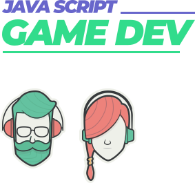

# Imersão GameDev Javascript

## 🤔 O que é? 

A Imersão GameDev é um programa totalmente **gratuito** e **inédito** criado pela **Alura**, com o intuito de ensinar sobre a criação de jogos.
Nele, você cria e coloca no ar o seu próprio jogo "endless runner"

##### Endless runner 
O  termo 'Endless runner' vem do inglês e sua tradução direta é "corrida infinita". 
Assim, "corrida infinita" é a ação na qual o jogador deve avançar sem parar em uma direção na velocidade mais alta possível. 
Em outras palavras, ele superará obstáculos e inimigos que tornarão seu caminho mais difícil. Podendo morrer e recomeçar do zero.

## 📚 História

Em Breve...

## 💡 Tecnologias

Esse projeto foi desenvolvido com as seguintes tecnologias:

- [Javascript](https://www.javascript.com/)
- [P5JS](https://p5js.org/)